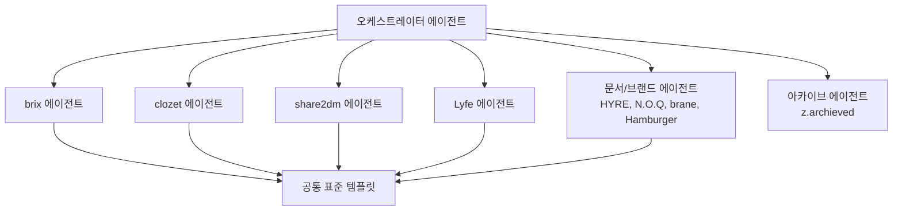

# 현재 `brix` 폴더를 분석한 결과, **앱 코드(`apps/`, `packages/`)는 이미 모노레포 

_source: Cursor · exported 2026-07-21T09:32:58.553Z_

## Assistant

현재 `brix` 폴더를 분석한 결과, **앱 코드(`apps/`, `packages/`)는 이미 모노레포 형태**인데 **비즈니스 자산·시크릿·문서·레거시 파일이 루트에 흩어져** 있습니다. 아래는 현업 수준으로 정리하기 위한 제안입니다.

---

## 현재 상태 진단

| 영역 | 현재 위치 | 문제 |
|------|-----------|------|
| 앱 코드 | `apps/green-apple`, `apps/red-apple` | ✅ 양호 |
| 공유 패키지 | `packages/shared`, `ui`, `theme` | ✅ 양호 |
| 랜딩페이지 | `landingpage/` (별도 `.git` 포함) | 모노레포 밖에 있음 |
| 비즈니스 자산 | `GreenApple/`, `RedApple/` | 앱 폴더명과 혼동, 시크릿 혼재 |
| 시크릿/인증서 | `idk/`, `GreenApple/*.p8`, `RedApple/*.p8` | 이름 불명확, 분산 저장 |
| 문서 | `docs/` 2개 + 루트 `2026_*.md`, `todo-*.md` | 엔지니어링/비즈니스 미분리 |
| 레거시 | 루트 `ios/` (`fitnessmonorepo`) | 사용 안 하는 구 iOS 프로젝트 |
| 스크립트 | `scripts/` | 역할 분류 없음 |
| DB/백엔드 | `apps/*/supabase/` | 앱 안에 묻혀 있음 |

---

## 제안 구조 (현업 모노레포 + 비즈니스 분리)

```
brix/
│
├── apps/                          # 배포 가능한 제품
│   ├── green-apple/               # 다이어트 코치 (Expo)
│   ├── red-apple/                 # 보디빌딩 코치 (Expo)
│   └── landing/                   # 마케팅 사이트 (landingpage → 이전)
│
├── packages/                      # 공유 라이브러리
│   ├── shared/                    # @repo/shared
│   ├── ui/                        # @repo/ui
│   └── theme/                     # @repo/theme
│
├── infra/                         # 인프라·백엔드 (앱에서 분리)
│   ├── green-apple/
│   │   └── supabase/              # migrations, functions
│   └── red-apple/
│       └── supabase/
│
├── tools/                         # 개발 도구·자동화
│   ├── scripts/
│   │   ├── crawl_exercises.py
│   │   └── exercises_data.json
│   └── maestro/                   # (선택) E2E 공통 설정
│
├── docs/                          # 엔지니어링 문서
│   ├── architecture/
│   │   └── monorepo.md
│   ├── product/
│   │   ├── green-apple-logic.md   # diet-app-logic.md
│   │   └── red-apple-logic.md
│   ├── design/
│   │   └── design-guide.md
│   ├── decisions/                 # ADR (Architecture Decision Records)
│   └── runbooks/                  # 배포·장애 대응
│
├── business/                      # 비즈니스·운영 (코드 아님)
│   ├── brand/
│   │   ├── green-apple/
│   │   │   └── brandbook.pdf
│   │   └── red-apple/
│   ├── planning/
│   │   ├── roadmaps/
│   │   ├── meetings/
│   │   │   ├── 2026-06-19.md
│   │   │   └── 2026-06-25.md
│   │   └── todos/
│   │       ├── green.md
│   │       ├── red.md
│   │       └── brix.md
│   ├── app-store/                 # ASC 메타, 스크린샷 기획
│   ├── marketing/                 # 카피, 캠페인, ASO
│   └── legal/                     # 약관, 개인정보처리방침 초안
│
├── .secrets/                      # ⚠️ git 제외, 1Password/로컬 전용
│   ├── apple/
│   │   ├── green-apple/
│   │   └── red-apple/
│   ├── google/
│   ├── firebase/
│   └── revenuecat/
│
├── .github/                       # CI/CD (추후)
│   └── workflows/
│
├── package.json
├── pnpm-workspace.yaml
├── turbo.json                     # (선택) 빌드 캐시
└── README.md
```

---

## 핵심 설계 원칙

### 1. 코드 vs 비즈니스 완전 분리
- `apps/`, `packages/`, `infra/`, `tools/` → **개발**
- `business/` → **기획, 브랜드, 회의록, TODO, 앱스토어 운영**
- 새 팀원이 와도 "코드는 여기, 사업 문서는 저기"가 바로 보입니다.

### 2. 시크릿은 레포 밖으로
`idk/`, `GreenApple/*.p8`, `RedApple/*.p8` 등은 **`.secrets/`로 통합**하고 `.gitignore`에 넣습니다. 현재 `.gitignore`에 `GreenApple/`, `RedApple/` 전체가 제외되어 있어 브랜드북 PDF까지 git에 안 올라갑니다 — **시크릿만 분리하고 브랜드 자산은 `business/brand/`로 이동**하는 게 맞습니다.

### 3. 랜딩페이지 모노레포 편입
`landingpage/`는 별도 git이 있어 `apps/landing/`으로 옮기고 nested `.git`을 제거한 뒤 `pnpm-workspace.yaml`에 추가합니다.

### 4. Supabase를 `infra/`로 승격
앱마다 DB가 다르므로 `apps/*/supabase/` → `infra/{app}/supabase/`로 옮기면 백엔드 변경이 앱 코드와 분리됩니다.

### 5. 레거시 정리
루트 `ios/fitnessmonorepo`, `dist/`, `app.json`, `bun.lock`(pnpm 사용 중)은 삭제 또는 아카이브 대상입니다.

---

## 파일 이동 매핑

| 현재 | 이동 후 |
|------|---------|
| `landingpage/` | `apps/landing/` |
| `GreenApple/Green Apple Brandbook...pdf` | `business/brand/green-apple/` |
| `GreenApple/*.p8`, `RedApple/*.p8` | `.secrets/apple/{app}/` |
| `idk/*` | `.secrets/{apple,google,firebase}/` |
| `2026_06_*.md` | `business/planning/meetings/` |
| `todo-*.md` | `business/planning/todos/` |
| `docs/diet-app-logic.md` | `docs/product/green-apple-logic.md` |
| `docs/design-guide.md` | `docs/design/design-guide.md` |
| `scripts/` | `tools/scripts/` |
| `apps/*/supabase/` | `infra/*/supabase/` |
| 루트 `ios/` | 삭제 (레거시) |

---

## `pnpm-workspace.yaml` 변경

```yaml
packages:
  - "apps/*"
  - "packages/*"
```

`apps/landing`이 추가되면 자동 포함됩니다.

---

## 단계별 마이그레이션 (권장 순서)

| Phase | 작업 | 리스크 |
|-------|------|--------|
| **1** | `business/`, `docs/` 재구성 (코드 영향 없음) | 낮음 |
| **2** | `.secrets/` 통합 + `.gitignore` 정리 | 낮음 |
| **3** | `landingpage/` → `apps/landing/` 편입 | 중간 (import 경로) |
| **4** | `scripts/` → `tools/scripts/` | 낮음 |
| **5** | `supabase/` → `infra/` | 중간 (CLI 경로 변경) |
| **6** | 레거시 `ios/`, `dist/`, `bun.lock` 정리 | 낮음 |
| **7** | README + `turbo.json` + CI 설정 | 낮음 |

---

## 추가로 고려할 사항

1. **Turborepo 도입** — `green`, `red`, `landing` 빌드를 캐시하고 병렬 실행
2. **네이밍 통일** — `GreenApple/`(PascalCase) 폴더 제거, 전부 `green-apple`(kebab-case)
3. **ADR 도입** — "왜 RevenueCat credit pass인가" 같은 결정을 `docs/decisions/`에 기록
4. **브랜드북 git 추적** — PDF는 LFS 또는 별도 스토리지(S3/Drive) 고려

---

원하시면 **Phase 1~2(비즈니스 폴더 + 시크릿 정리)**부터 실제로 파일을 옮기고 `README.md`, `.gitignore`, `pnpm-workspace.yaml`까지 맞춰 드릴 수 있습니다. 전체 Phase를 한 번에 진행할지, 아니면 단계별로 할지 알려주세요.

## Assistant

요청하신 대로 Supabase는 앱 안에 두고, 나머지 재구성(네이밍 통일, ADR, 브랜드북 LFS)을 진행합니다. 먼저 프로젝트 루트로 이동한 뒤 작업을 시작합니다.

## User

/Users/jw/JW_Projects/brix 이 폴더 안에는 두개의 앱이 있음. 모노레포로 red apple 과 green apple. 이 프로젝트 폴더를 현업 수준으로 폴더 구조를 재구성 하고 싶어. 해당 폴더에는 개발 뿐만 아니라, 비즈니스 관련 내용도 있음.

## User

4번 supabase 냅두고, 나머지 네이밍 통일 — GreenApple/(PascalCase) 폴더 제거, 전부 green-apple(kebab-case)
ADR 도입 — "왜 RevenueCat credit pass인가" 같은 결정을 docs/decisions/에 기록
브랜드북 git 추적 — PDF는 LFS 또는 별도 스토리지(S3/Drive) 고려 까지 하자.

## Assistant

프로젝트 현재 구조를 먼저 파악한 뒤, 현업 수준의 모노레포 재구성안을 제안하겠습니다.

## Assistant

요청하신 대로 Supabase는 앱 안에 두고, 나머지 재구성(네이밍 통일, ADR, 브랜드북 LFS)을 진행합니다. 먼저 프로젝트 루트로 이동한 뒤 작업을 시작합니다.

## Assistant

현재 `brix` 폴더를 분석한 결과, **앱 코드(`apps/`, `packages/`)는 이미 모노레포 형태**인데 **비즈니스 자산·시크릿·문서·레거시 파일이 루트에 흩어져** 있습니다. 아래는 현업 수준으로 정리하기 위한 제안입니다.

---

## 현재 상태 진단

| 영역 | 현재 위치 | 문제 |
|------|-----------|------|
| 앱 코드 | `apps/green-apple`, `apps/red-apple` | ✅ 양호 |
| 공유 패키지 | `packages/shared`, `ui`, `theme` | ✅ 양호 |
| 랜딩페이지 | `landingpage/` (별도 `.git` 포함) | 모노레포 밖에 있음 |
| 비즈니스 자산 | `GreenApple/`, `RedApple/` | 앱 폴더명과 혼동, 시크릿 혼재 |
| 시크릿/인증서 | `idk/`, `GreenApple/*.p8`, `RedApple/*.p8` | 이름 불명확, 분산 저장 |
| 문서 | `docs/` 2개 + 루트 `2026_*.md`, `todo-*.md` | 엔지니어링/비즈니스 미분리 |
| 레거시 | 루트 `ios/` (`fitnessmonorepo`) | 사용 안 하는 구 iOS 프로젝트 |
| 스크립트 | `scripts/` | 역할 분류 없음 |
| DB/백엔드 | `apps/*/supabase/` | 앱 안에 묻혀 있음 |

---

## 제안 구조 (현업 모노레포 + 비즈니스 분리)

```
brix/
│
├── apps/                          # 배포 가능한 제품
│   ├── green-apple/               # 다이어트 코치 (Expo)
│   ├── red-apple/                 # 보디빌딩 코치 (Expo)
│   └── landing/                   # 마케팅 사이트 (landingpage → 이전)
│
├── packages/                      # 공유 라이브러리
│   ├── shared/                    # @repo/shared
│   ├── ui/                        # @repo/ui
│   └── theme/                     # @repo/theme
│
├── infra/                         # 인프라·백엔드 (앱에서 분리)
│   ├── green-apple/
│   │   └── supabase/              # migrations, functions
│   └── red-apple/
│       └── supabase/
│
├── tools/                         # 개발 도구·자동화
│   ├── scripts/
│   │   ├── crawl_exercises.py
│   │   └── exercises_data.json
│   └── maestro/                   # (선택) E2E 공통 설정
│
├── docs/                          # 엔지니어링 문서
│   ├── architecture/
│   │   └── monorepo.md
│   ├── product/
│   │   ├── green-apple-logic.md   # diet-app-logic.md
│   │   └── red-apple-logic.md
│   ├── design/
│   │   └── design-guide.md
│   ├── decisions/                 # ADR (Architecture Decision Records)
│   └── runbooks/                  # 배포·장애 대응
│
├── business/                      # 비즈니스·운영 (코드 아님)
│   ├── brand/
│   │   ├── green-apple/
│   │   │   └── brandbook.pdf
│   │   └── red-apple/
│   ├── planning/
│   │   ├── roadmaps/
│   │   ├── meetings/
│   │   │   ├── 2026-06-19.md
│   │   │   └── 2026-06-25.md
│   │   └── todos/
│   │       ├── green.md
│   │       ├── red.md
│   │       └── brix.md
│   ├── app-store/                 # ASC 메타, 스크린샷 기획
│   ├── marketing/                 # 카피, 캠페인, ASO
│   └── legal/                     # 약관, 개인정보처리방침 초안
│
├── .secrets/                      # ⚠️ git 제외, 1Password/로컬 전용
│   ├── apple/
│   │   ├── green-apple/
│   │   └── red-apple/
│   ├── google/
│   ├── firebase/
│   └── revenuecat/
│
├── .github/                       # CI/CD (추후)
│   └── workflows/
│
├── package.json
├── pnpm-workspace.yaml
├── turbo.json                     # (선택) 빌드 캐시
└── README.md
```

---

## 핵심 설계 원칙

### 1. 코드 vs 비즈니스 완전 분리
- `apps/`, `packages/`, `infra/`, `tools/` → **개발**
- `business/` → **기획, 브랜드, 회의록, TODO, 앱스토어 운영**
- 새 팀원이 와도 "코드는 여기, 사업 문서는 저기"가 바로 보입니다.

### 2. 시크릿은 레포 밖으로
`idk/`, `GreenApple/*.p8`, `RedApple/*.p8` 등은 **`.secrets/`로 통합**하고 `.gitignore`에 넣습니다. 현재 `.gitignore`에 `GreenApple/`, `RedApple/` 전체가 제외되어 있어 브랜드북 PDF까지 git에 안 올라갑니다 — **시크릿만 분리하고 브랜드 자산은 `business/brand/`로 이동**하는 게 맞습니다.

### 3. 랜딩페이지 모노레포 편입
`landingpage/`는 별도 git이 있어 `apps/landing/`으로 옮기고 nested `.git`을 제거한 뒤 `pnpm-workspace.yaml`에 추가합니다.

### 4. Supabase를 `infra/`로 승격
앱마다 DB가 다르므로 `apps/*/supabase/` → `infra/{app}/supabase/`로 옮기면 백엔드 변경이 앱 코드와 분리됩니다.

### 5. 레거시 정리
루트 `ios/fitnessmonorepo`, `dist/`, `app.json`, `bun.lock`(pnpm 사용 중)은 삭제 또는 아카이브 대상입니다.

---

## 파일 이동 매핑

| 현재 | 이동 후 |
|------|---------|
| `landingpage/` | `apps/landing/` |
| `GreenApple/Green Apple Brandbook...pdf` | `business/brand/green-apple/` |
| `GreenApple/*.p8`, `RedApple/*.p8` | `.secrets/apple/{app}/` |
| `idk/*` | `.secrets/{apple,google,firebase}/` |
| `2026_06_*.md` | `business/planning/meetings/` |
| `todo-*.md` | `business/planning/todos/` |
| `docs/diet-app-logic.md` | `docs/product/green-apple-logic.md` |
| `docs/design-guide.md` | `docs/design/design-guide.md` |
| `scripts/` | `tools/scripts/` |
| `apps/*/supabase/` | `infra/*/supabase/` |
| 루트 `ios/` | 삭제 (레거시) |

---

## `pnpm-workspace.yaml` 변경

```yaml
packages:
  - "apps/*"
  - "packages/*"
```

`apps/landing`이 추가되면 자동 포함됩니다.

---

## 단계별 마이그레이션 (권장 순서)

| Phase | 작업 | 리스크 |
|-------|------|--------|
| **1** | `business/`, `docs/` 재구성 (코드 영향 없음) | 낮음 |
| **2** | `.secrets/` 통합 + `.gitignore` 정리 | 낮음 |
| **3** | `landingpage/` → `apps/landing/` 편입 | 중간 (import 경로) |
| **4** | `scripts/` → `tools/scripts/` | 낮음 |
| **5** | `supabase/` → `infra/` | 중간 (CLI 경로 변경) |
| **6** | 레거시 `ios/`, `dist/`, `bun.lock` 정리 | 낮음 |
| **7** | README + `turbo.json` + CI 설정 | 낮음 |

---

## 추가로 고려할 사항

1. **Turborepo 도입** — `green`, `red`, `landing` 빌드를 캐시하고 병렬 실행
2. **네이밍 통일** — `GreenApple/`(PascalCase) 폴더 제거, 전부 `green-apple`(kebab-case)
3. **ADR 도입** — "왜 RevenueCat credit pass인가" 같은 결정을 `docs/decisions/`에 기록
4. **브랜드북 git 추적** — PDF는 LFS 또는 별도 스토리지(S3/Drive) 고려

---

원하시면 **Phase 1~2(비즈니스 폴더 + 시크릿 정리)**부터 실제로 파일을 옮기고 `README.md`, `.gitignore`, `pnpm-workspace.yaml`까지 맞춰 드릴 수 있습니다. 전체 Phase를 한 번에 진행할지, 아니면 단계별로 할지 알려주세요.

## User

이런 작업을 새로운 여러 에이전트로, 해줄수 있어 ? /Users/jw/JW_Projects 안에 있는 모든 프로젝트들 ?

## Assistant

`/Users/jw/JW_Projects` 안에 어떤 프로젝트들이 있는지 먼저 확인한 뒤, 여러 에이전트로 병렬 재구성이 가능한지 판단하겠습니다.

## Assistant

네, **가능합니다.** Cursor에서 에이전트를 프로젝트별로 나눠 **병렬로** 돌릴 수 있습니다. 다만 `JW_Projects` 안 프로젝트들은 성격이 꽤 달라서, **같은 템플릿을 일괄 적용하기보다 프로젝트 유형별로 에이전트를 나누는 방식**이 맞습니다.

---

## 현재 `JW_Projects` 현황

| 프로젝트 | 유형 | git | 재구성 난이도 |
|----------|------|-----|---------------|
| **brix** | 모노레포 (2앱 + 패키지) | ✅ | 중간 (이미 논의함) |
| **clozet** | 멀티서비스 (App, BackOffice, CDN, Monitor) | ❌ | 높음 |
| **share2dm** | 웹 + workers + supabase | ✅ | 중간 |
| **Lyfe** | App + BackOffice | ❌ | 중간 |
| **HYRE** | PRD/기획 문서만 | ❌ | 낮음 |
| **N.O.Q** | 브랜드 에셋만 | ❌ | 낮음 |
| **PEGASUS** | 로봇 대회 + 프로토타입 | ❌ | 낮음~중간 |
| **brane** | 랜딩 에셋 3개 | ❌ | 낮음 |
| **Hambuger STUD.io** | IR 자료 + 로고 | ❌ | 낮음 |
| **z.archieved** | 아카이브 | ❌ | 낮음 (정리만) |
| **공인 문서** | 사업자등록·세금 등 | ❌ | 낮음 (건드리지 않음 권장) |

추가로 `JW_Projects` **루트 자체**에 `.env`, `.venv`, `.idea`가 있어서, 개별 프로젝트 정리 전에 상위 폴더도 한번 정리하는 게 좋습니다.

---

## 병렬 에이전트 운영 방식



각 에이전트에게 **동일한 골격**을 주되, 프로젝트별 예외만 명시합니다:

```
{project}/
├── apps/           # 배포 단위 (코드 있는 경우)
├── packages/       # 공유 라이브러리 (있는 경우)
├── docs/           # 엔지니어링 문서 + decisions/ (ADR)
├── business/       # 기획, 브랜드, 회의록, TODO
├── tools/          # 스크립트, 자동화
└── .secrets/       # git 제외 (인증서, API 키)
```

**공통 규칙:**
- PascalCase 폴더 → kebab-case 통일
- PDF/대용량 → Git LFS 또는 `business/brand/` + LFS
- 시크릿 → `.secrets/` (gitignore)
- supabase는 **앱 안에 유지** (brix 기준)

---

## 프로젝트별 에이전트 작업 범위

### 에이전트 1 — `brix` (이미 설계됨)
- `business/`, `docs/decisions/`, `tools/` 생성
- `GreenApple/` → `.secrets/` + `business/brand/green-apple/`
- `landingpage/` → `apps/landing/`
- Git LFS + ADR (RevenueCat credit pass 등)
- supabase는 `apps/*/supabase/` 유지

### 에이전트 2 — `clozet`
- `clozet_App` → `apps/clozet-app`
- `clozet_BackOffice` → `apps/backoffice`
- `clozet_CDN` → `apps/cdn` 또는 `infra/cdn`
- `clozet_Monitor` → `apps/monitor`
- `clozet-landing` → `apps/landing`
- 루트에 `pnpm-workspace.yaml` + git 초기화

### 에이전트 3 — `share2dm`
- `web/` → `apps/web`
- `workers/` → `apps/workers` 또는 `tools/workers`
- `supabase/` 유지 (앱 근처)
- `docs/`, `business/` 분리

### 에이전트 4 — `Lyfe`
- `Lyfe_App` → `apps/lyfe-app`
- `Lyfe_BackOffice` → `apps/backoffice`
- git 초기화 + 모노레포 구조

### 에이전트 5 — 문서/브랜드 전용
- **HYRE**: `docs/product/`, `business/planning/`
- **N.O.Q**: `business/brand/` + LFS
- **brane**, **Hambuger STUD.io**: `business/brand/`, `business/planning/`
- **PEGASUS**: `docs/`, `business/competition/`, `apps/prototype/`

### 에이전트 6 — 아카이브
- `z.archieved/` 내부만 정리, 활성 프로젝트는 건드리지 않음

### 건드리지 않을 것
- **공인 문서** — 법적 서류, 구조 변경 위험

---

## 주의사항

1. **병렬 실행 시 충돌 없음** — 프로젝트 폴더가 분리되어 있어 동시 작업 가능
2. **git 없는 프로젝트 8개** — 이동 전 백업 또는 git init 권장
3. **clozet / Lyfe** — Flutter, React Native 등 스택이 달라 구조만 통일하고 빌드 설정은 프로젝트별 유지
4. **JW_Projects 루트 `.env`** — 어느 프로젝트 것인지 확인 후 해당 `.secrets/`로 이동
5. **한 번에 전부 vs 단계적** — 6개 에이전트 동시 실행 가능하지만, **brix → clozet → 나머지** 순으로 검증 후 확장하는 편이 안전

---

## 추천 실행 순서

| 단계 | 작업 | 에이전트 수 |
|------|------|-------------|
| 1 | `brix` 완료 (이미 설계됨) | 1 |
| 2 | `clozet`, `share2dm`, `Lyfe` 병렬 | 3 |
| 3 | HYRE, N.O.Q, brane, PEGASUS, Hamburger 병렬 | 1~2 |
| 4 | `z.archieved` + `JW_Projects` 루트 정리 | 1 |

---

**brix부터 에이전트 1개로 시작**할지, **clozet + share2dm + Lyfe 3개를 동시에** 돌릴지 알려주시면 그에 맞춰 에이전트를 띄우겠습니다.

## User

응 다 해줘.

## Assistant

전체 프로젝트 재구성을 시작합니다. 프로젝트별로 에이전트를 병렬 실행하고, 완료되면 결과를 통합하겠습니다.

## Assistant

6개 에이전트가 병렬로 실행 중입니다. 완료 여부를 확인하겠습니다.

## Assistant

백그라운드 에이전트가 아직 진행 중이라, 직접 실행해 전체 재구성을 완료하겠습니다.

## Assistant

Lyfe 재구성은 완료됐습니다. 나머지 프로젝트 작업을 이어가며, 차단된 명령은 승인 요청과 함께 재시도합니다.

## User

응 다 해줘.
